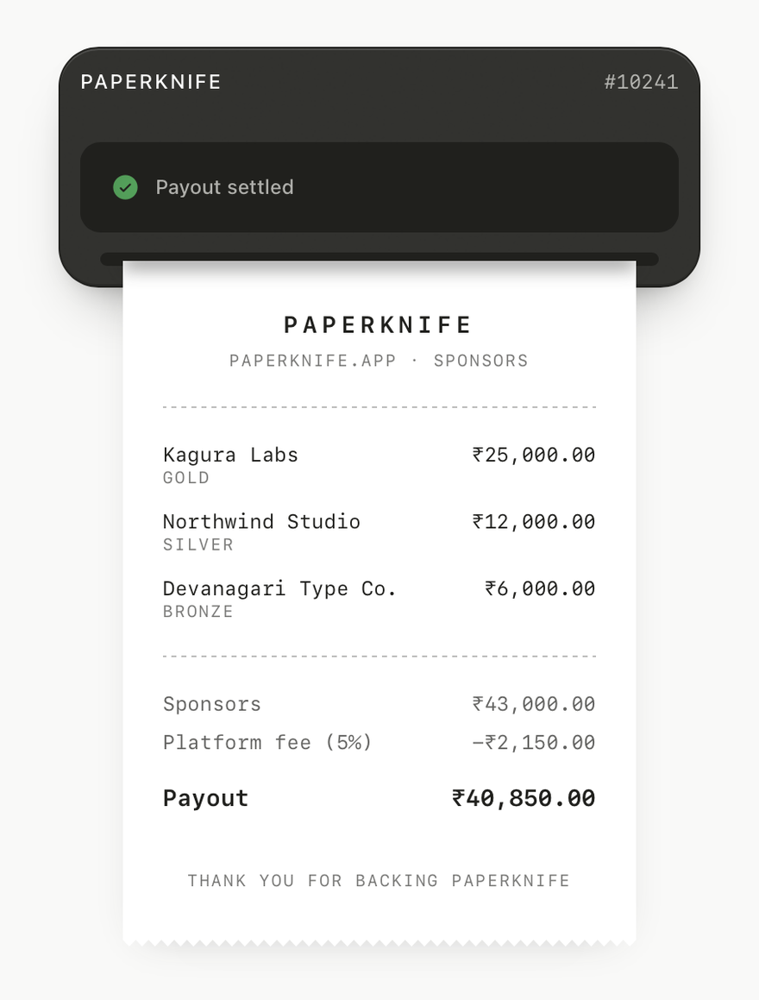

# receipt-printer

A compound React component that animates a thermal receipt printer: a plastic machine
body, a status screen, and a paper roll that feeds out line-by-line as it "prints".

Built for Next.js (App Router) with Tailwind CSS v4 and `motion/react`.

<p align="center">
  <picture>
    <source media="(prefers-color-scheme: dark)" srcset="docs/receipt-printer-dark.png">
    
  </picture>
</p>

## Demo

The repo is a runnable Next.js app. It cycles the printer through all three stages and
exposes toggles for the feed motion and the theme.

```bash
npm install
npm run dev
```

Then open http://localhost:3000. Append `?theme=light` or `?theme=dark` to pin the theme
instead of following the system — that's how the screenshots above were captured.

## Usage

```tsx
"use client";

import { useEffect, useState } from "react";
import {
  ReceiptPrinter,
  type ReceiptPrinterStage,
} from "@/components/receipt-printer";

export function SponsorReceipt() {
  const [stage, setStage] = useState<ReceiptPrinterStage>("processing");

  useEffect(() => {
    const toPrinting = setTimeout(() => setStage("printing"), 1400);
    const toComplete = setTimeout(() => setStage("complete"), 3300);

    return () => {
      clearTimeout(toPrinting);
      clearTimeout(toComplete);
    };
  }, []);

  return (
    <ReceiptPrinter.Root feedMotion="stepped" stage={stage}>
      <ReceiptPrinter.Machine>
        <ReceiptPrinter.Header>
          <span className="font-medium text-xs">PaperKnife</span>
        </ReceiptPrinter.Header>
        <ReceiptPrinter.Screen>
          <ReceiptPrinter.Status />
        </ReceiptPrinter.Screen>
      </ReceiptPrinter.Machine>

      <ReceiptPrinter.Output>
        <ReceiptPrinter.Paper>
          <h2 className="text-center text-sm uppercase">Sponsors</h2>
          <p className="mt-4 text-xs">Kagura Labs — ₹25,000.00</p>
          <p className="text-xs">Northwind Studio — ₹12,000.00</p>
          <p className="mt-4 text-xs">Payout — ₹40,850.00</p>
        </ReceiptPrinter.Paper>
      </ReceiptPrinter.Output>
    </ReceiptPrinter.Root>
  );
}
```

## API

### `ReceiptPrinter.Root`

| Prop | Type | Default | Description |
| --- | --- | --- | --- |
| `stage` | `"processing" \| "printing" \| "complete"` | — | Current printer state. Required. |
| `feedMotion` | `"stepped" \| "smooth"` | `"stepped"` | Stepped feeds the paper one line at a time; smooth eases it out in one motion. |
| `animate` | `boolean` | `true` | Set to `false` to disable all stage transitions. |

Also accepts every `<section>` prop. `aria-label` defaults to `"Receipt printer"`.

### Other parts

- `ReceiptPrinter.Machine` — printer chassis, includes the paper slot. Renders a `<div>`.
- `ReceiptPrinter.Header` — top strip of the chassis, for a title or reference number.
- `ReceiptPrinter.Screen` — inset dark display panel.
- `ReceiptPrinter.Status` — spinner/check icon plus an `aria-live` label. Defaults to a
  label derived from `stage`; pass children to override:
  ```tsx
  <ReceiptPrinter.Status>{stage === "complete" ? "Payout settled" : "Tallying sponsors"}</ReceiptPrinter.Status>
  ```
- `ReceiptPrinter.Output` — masks and drives the paper feed animation.
- `ReceiptPrinter.Paper` — the receipt itself, clipped with a torn zig-zag edge. Renders
  an `<article>`.

Everything except `Root` must be rendered inside `ReceiptPrinter.Root` — the parts read
stage and motion settings from context and throw otherwise.

## Requirements

- `react` 19
- `motion` (`motion/react`)
- `@phosphor-icons/react`
- Tailwind CSS v4

To drop `components/receipt-printer.tsx` into another project, bring these along:

- `helpers/classname-helper.ts` — the `cn` class-merge helper it imports.
- The `grayscale-1` … `grayscale-12` and `green-9` theme colors from `app/globals.css`.
  Step 1 is the app background and step 12 the high-contrast foreground, and the ramp
  inverts under `.dark` so the component's `dark:` variants read the same way in both
  themes. The shadows use `color-mix()` on `--color-grayscale-*` directly, so those CSS
  variables have to exist, not just the Tailwind utilities.
- `public/textures/plastic-noise.svg` and `public/textures/receipt-paper.svg`. Without
  them the component still renders — the surfaces just lose their grain.

Motion respects `prefers-reduced-motion`: the paper appears in place instead of feeding.
